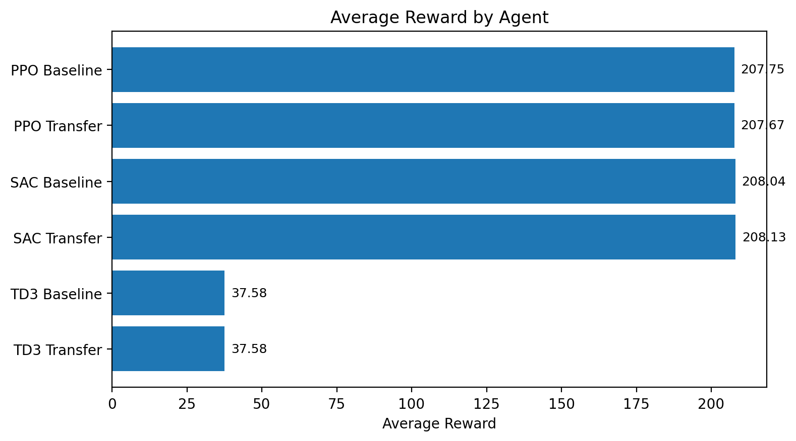
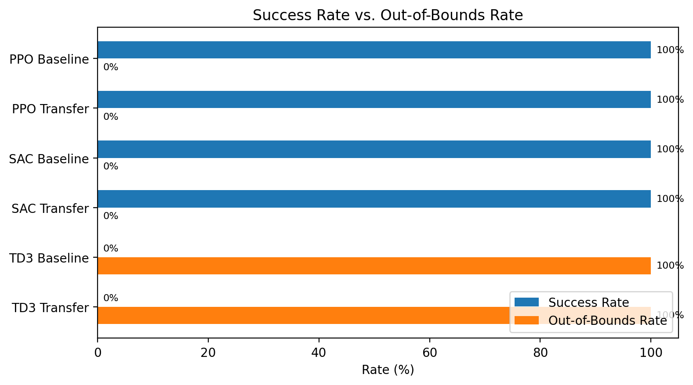

# Cross-Domain Reinforcement Learning for UAV-to-UGV Autonomous Navigation

A reinforcement learning project comparing **PPO**, **SAC**, and **TD3** for simulated autonomous navigation. The project explores whether behavior learned in a UAV-style obstacle-navigation environment can transfer to a UGV navigation task.

This repository includes custom navigation environments, training scripts, transfer-learning utilities, evaluation code, result summaries, and generated plots for comparing baseline and transfer-learning agents.

---

## Overview

Training autonomous agents from scratch can be expensive and time-consuming, especially when each platform or environment requires separate tuning. This project investigates whether reinforcement learning experience from one navigation domain can help improve learning in another.

The experiment follows three main stages:

1. Train UAV navigation agents.
2. Train baseline UGV agents from scratch.
3. Train UGV transfer agents using UAV-trained behavior as the starting point.

The goal is to compare baseline UGV performance against UAV-to-UGV transfer-learning performance across multiple reinforcement learning algorithms.

---

## Key Features

- Custom UAV and UGV navigation environments
- PPO, SAC, and TD3 training scripts
- Baseline UGV training from scratch
- UAV-to-UGV transfer-learning experiments
- Evaluation script for comparing trained agents
- Results documentation with real evaluation metrics
- Generated plots for reward, success rate, and out-of-bounds behavior
- Clean Python project structure using Stable-Baselines3 and Gymnasium

---

## Algorithms Compared

| Algorithm | Type | Purpose in Project |
|---|---|---|
| PPO | On-policy | Stable policy optimization baseline for navigation tasks |
| SAC | Off-policy | Continuous-control algorithm with entropy-based exploration |
| TD3 | Off-policy | Continuous-control algorithm using twin critics and delayed policy updates |

---

## Repository Structure

```text
rl-tl-drone-to-ugv/
│
├── README.md
├── requirements.txt
├── .gitignore
│
├── src/
│   ├── __init__.py
│   │
│   ├── envs/
│   │   ├── __init__.py
│   │   ├── drone_env.py
│   │   └── ugv_env.py
│   │
│   ├── train/
│   │   ├── __init__.py
│   │   ├── train_drone_ppo.py
│   │   ├── train_drone_sac.py
│   │   ├── train_drone_td3.py
│   │   ├── train_ugv_baseline.py
│   │   ├── train_ugv_sac.py
│   │   ├── train_ugv_td3.py
│   │   ├── train_ugv_transfer.py
│   │   ├── train_ugv_sac_transfer.py
│   │   └── train_ugv_td3_transfer.py
│   │
│   ├── eval/
│   │   ├── __init__.py
│   │   ├── evaluate_agent.py
│   │   └── plot_results.py
│   │
│   └── models/
│       ├── __init__.py
│       └── transfer_utils.py
│
├── results/
│   ├── evaluation_summary.md
│   ├── evaluation_results.csv
│   ├── raw_evaluation_output.txt
│   └── plots/
│       ├── average_reward_comparison.png
│       └── success_vs_out_of_bounds.png
│
├── configs/
├── docs/
└── tests/
```

---

## Environment Design

### UAV Environment

The UAV environment represents a simplified aerial obstacle-navigation task. The agent learns to move through a simulated space, avoid obstacles, stay within environment boundaries, and reach a target location.

### UGV Environment

The UGV environment represents a simplified ground-vehicle navigation task. The agent learns to move toward a goal while avoiding obstacles and minimizing invalid or out-of-bounds movement.

Both environments were designed to support comparison between agents trained from scratch and agents trained using transfer learning.

---

## Training Workflow

### 1. UAV Training

Train PPO, SAC, and TD3 agents in the UAV navigation environment.

### 2. UGV Baseline Training

Train UGV agents from scratch to establish baseline performance.

### 3. UAV-to-UGV Transfer Training

Use UAV-trained behavior as a starting point for UGV training, then compare transfer-learning performance against baseline UGV training.

---

## Evaluation Metrics

Agents are evaluated using:

- Average reward
- Success rate
- Average episode length
- Out-of-bounds rate
- Baseline vs. transfer-learning performance
- Training stability and convergence behavior

These metrics are used to measure both reward optimization and practical navigation behavior.

---

## Results Summary

PPO and SAC produced the most stable navigation behavior in the tested environments. TD3 required additional tuning for consistent navigation success.

| Agent | Training Type | Average Reward | Success Rate | Avg Episode Length | Out-of-Bounds Rate |
|---|---|---:|---:|---:|---:|
| PPO UGV Baseline | From scratch | 207.75 | 100.00% | 65.00 | 0.00% |
| PPO UGV Transfer | UAV-to-UGV transfer | 207.67 | 100.00% | 65.00 | 0.00% |
| SAC UGV Baseline | From scratch | 208.04 | 100.00% | 66.00 | 0.00% |
| SAC UGV Transfer | UAV-to-UGV transfer | 208.13 | 100.00% | 69.00 | 0.00% |
| TD3 UGV Baseline | From scratch | 37.58 | 0.00% | 76.00 | 100.00% |
| TD3 UGV Transfer | UAV-to-UGV transfer | 37.58 | 0.00% | 76.00 | 100.00% |

For more detail, see:

```text
results/evaluation_summary.md
```

---

## Evaluation Plots

### Average Reward Comparison



### Success Rate vs. Out-of-Bounds Rate



---

## Main Findings

PPO and SAC achieved stable UGV navigation performance in this evaluation, with both baseline and transfer-learning agents reaching a 100% success rate and 0% out-of-bounds rate.

TD3 performed poorly in the tested setup. Both TD3 baseline and TD3 transfer agents had a 0% success rate and 100% out-of-bounds rate, suggesting that TD3 required additional tuning for this environment.

The transfer-learning agents did not show a major improvement over the baseline agents in this evaluation. PPO baseline and PPO transfer produced nearly identical results, while SAC transfer had the highest average reward but a slightly longer average episode length.

---

## Installation

### 1. Clone the repository

```bash
git clone https://github.com/alexvarg565/rl-tl-drone-to-ugv.git
cd rl-tl-drone-to-ugv
```

### 2. Create a virtual environment

```bash
python -m venv .venv
```

### 3. Activate the virtual environment

On Windows PowerShell:

```powershell
.venv\Scripts\Activate.ps1
```

On macOS/Linux:

```bash
source .venv/bin/activate
```

### 4. Install dependencies

```bash
pip install -r requirements.txt
```

---

## Training Commands

### Train UAV agents

```bash
python -m src.train.train_drone_ppo
python -m src.train.train_drone_sac
python -m src.train.train_drone_td3
```

### Train baseline UGV agents

```bash
python -m src.train.train_ugv_baseline
python -m src.train.train_ugv_sac
python -m src.train.train_ugv_td3
```

### Train transfer-learning UGV agents

```bash
python -m src.train.train_ugv_transfer
python -m src.train.train_ugv_sac_transfer
python -m src.train.train_ugv_td3_transfer
```

---

## Evaluation

Run the evaluation script:

```bash
python -m src.eval.evaluate_agent
```

Generate evaluation plots:

```bash
python -m src.eval.plot_results
```

The evaluation script compares trained agents using reward, success rate, average episode length, and out-of-bounds behavior.

---

## Technologies Used

- Python
- Stable-Baselines3
- Gymnasium
- PyTorch
- NumPy
- Pandas
- Matplotlib
- TensorBoard
- Git / GitHub

---

## Limitations

This project is a simulation-based research prototype. The environments are simplified and do not fully model real-world UAV or UGV dynamics, sensor noise, localization uncertainty, or physical constraints.

Future work would require more realistic simulation, stronger environment randomization, broader hyperparameter tuning, and additional validation before deployment to physical robotic systems.

---

## Future Improvements

- Add environment screenshots or demo videos
- Run larger hyperparameter sweeps
- Improve reward shaping and penalty scaling
- Add more realistic obstacle layouts
- Add sensor-style observations
- Compare additional transfer-learning strategies
- Test policies in higher-fidelity simulation environments
- Improve TD3 training stability through hyperparameter tuning

---

## Author

**Alexander Vargas**  
Computer Engineering Student  
California State University, San Bernardino  
GitHub: [alexvarg565](https://github.com/alexvarg565)